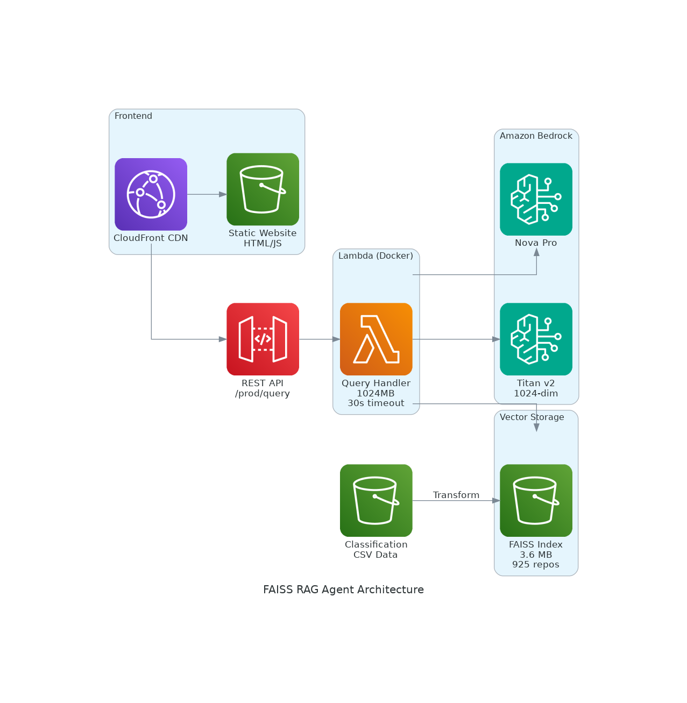

# FAISS RAG Agent - Cost-Optimized AWS Solution Finder

Production-ready RAG (Retrieval-Augmented Generation) agent using FAISS vector search, S3 storage, and Amazon Nova Pro. Achieves **99.7% cost reduction** compared to OpenSearch Serverless.

🔗 **Live Demo**: https://awssolutionfinder.solutions.cloudnestle.com

## 🎯 Overview

Intelligent search and discovery system for 7,552+ AWS sample repositories with natural language queries powered by semantic search and LLM-based responses.

**Key Achievement**: Reduced monthly costs from **$345 to $1** while maintaining similar performance.

## 📊 Architecture



### Components

- **Frontend**: CloudFront + S3 static website
- **API**: API Gateway REST endpoint
- **Compute**: Lambda (Docker container, 1024MB, 30s timeout)
- **Vector Storage**: FAISS index (3.6 MB) stored in S3
- **Embeddings**: Amazon Titan Text Embeddings v2 (1024 dimensions)
- **LLM**: Amazon Nova Pro via inference profile
- **Data Source**: 7,552 classified AWS repositories

## 💰 Cost Comparison

### Old System (OpenSearch Serverless)
- **Fixed Cost**: $345/month (2 OCU minimum)
- **Variable Cost**: ~$0.001/request
- **Total**: $345-355/month

### New System (FAISS + S3)
- **S3 Storage**: $0.01/month (3.6 MB index)
- **Lambda**: $0.50/month (1000 requests)
- **Nova Pro**: $0.28/month (1000 requests)
- **Embeddings**: $0.002/month (1000 requests)
- **API Gateway**: $0.01/month
- **CloudFront**: $0.10/month
- **Total**: ~$1/month

**Savings**: 99.7% cost reduction ($344/month saved)

## ⚡ Performance

### Cold Start (First Request)
- **Total**: 7.9s
  - Lambda Init: 1.3s
  - S3 Download: 0.89s
  - FAISS Load: 0.02s
  - Nova Pro: 5.12s

### Warm Start (Subsequent Requests)
- **Total**: 6-7s
  - Embedding: 0.09s
  - FAISS Search: 0.001s
  - Nova Pro: 5-7s

### Index Metrics
- **Size**: 3.6 MB (925 repositories)
- **Search Speed**: 0.001s (1ms)
- **Memory Usage**: 133 MB peak

## 🚀 Quick Start

### Prerequisites
- AWS Account with permissions for:
  - S3, Lambda, API Gateway, CloudFront
  - Bedrock (Titan Embeddings v2, Nova Pro)
- AWS CDK installed
- Docker installed
- Node.js 18+

### Deployment

```bash
# 1. Clone repository
git clone https://github.com/ajitnk-lab/faiss-rag-agent.git
cd faiss-rag-agent

# 2. Install dependencies
npm install

# 3. Deploy infrastructure
./deploy.sh

# 4. (Optional) Setup custom domain
./scripts/setup_https.sh
```

### Manual Deployment Steps

```bash
# 1. Build FAISS index from classification data
python3 scripts/build_faiss_index.py

# 2. Upload to S3
aws s3 cp data/faiss_index.bin s3://faiss-rag-agent-vectors-{ACCOUNT_ID}/
aws s3 cp data/metadata.json s3://faiss-rag-agent-vectors-{ACCOUNT_ID}/

# 3. Deploy CDK stack
cd cdk
npm install
cdk deploy
```

## 📁 Project Structure

```
faiss-rag-agent/
├── cdk/                          # CDK infrastructure code
│   ├── lib/
│   │   └── faiss-rag-stack.ts   # Main stack definition
│   └── bin/
│       └── faiss-rag.ts         # CDK app entry point
├── lambda/                       # Lambda function code
│   ├── query_handler.py         # Main handler
│   ├── Dockerfile               # Container definition
│   └── requirements.txt         # Python dependencies
├── scripts/                      # Utility scripts
│   ├── transform_data.py        # CSV to JSON transformation
│   ├── build_faiss_index.py     # FAISS index generation
│   ├── setup_https.sh           # HTTPS configuration
│   └── setup_custom_domain.sh   # Custom domain setup
├── ui/                          # Frontend application
│   └── index.html               # Single-page chat interface
├── data/                        # Generated data files
│   ├── faiss_index.bin          # FAISS vector index
│   └── metadata.json            # Repository metadata
├── docs/                        # Documentation
│   └── architecture.png         # Architecture diagram
├── deploy.sh                    # Automated deployment script
├── DEPLOYMENT.md                # Detailed deployment guide
└── README.md                    # This file
```

## 🔧 Configuration

### Environment Variables (Lambda)

```bash
BUCKET_NAME=faiss-rag-agent-vectors-{ACCOUNT_ID}
FAISS_INDEX_KEY=faiss_index.bin
METADATA_KEY=metadata.json
NOVA_MODEL_ID=us.amazon.nova-pro-v1:0
EMBEDDING_MODEL_ID=amazon.titan-embed-text-v2:0
```

### CDK Context

```json
{
  "domain": "awssolutionfinder.solutions.cloudnestle.com",
  "certificateArn": "arn:aws:acm:us-east-1:...",
  "hostedZoneId": "Z..."
}
```

## 🎨 Features

### Natural Language Search
```
Query: "How do I build a serverless API with authentication?"
Results: Relevant repositories with Lambda, API Gateway, Cognito
```

### Semantic Understanding
- Understands intent beyond keyword matching
- Finds related solutions even with different terminology
- Ranks results by relevance

### LLM-Powered Responses
- Contextual answers using Nova Pro
- Synthesizes information from multiple repositories
- Provides actionable recommendations

## 📊 Data Pipeline

### 1. Classification (Source Data)
```bash
# 7,552 AWS repositories classified with:
- Solution type, competency, use case
- AWS services, deployment tools
- Cost range, setup time
- Business value, target audience
```

### 2. Transformation
```python
# Convert CSV to JSON format
python3 scripts/transform_data.py
```

### 3. Embedding Generation
```python
# Generate 1024-dim vectors using Titan v2
python3 scripts/build_faiss_index.py
```

### 4. FAISS Index Creation
```python
# Build IndexFlatL2 with 925 vectors
# Output: 3.6 MB binary file
```

## 🔐 Security

- **API Gateway**: CORS enabled, throttling configured
- **Lambda**: IAM role with least privilege
- **S3**: Bucket policies for CloudFront OAC
- **CloudFront**: HTTPS only, custom domain with ACM
- **Bedrock**: Cross-region inference profile access

## 📈 Monitoring

### CloudWatch Metrics
- Lambda invocations, duration, errors
- API Gateway requests, latency, 4xx/5xx
- S3 GET requests, data transfer

### Cost Tracking
- Cost allocation tags: `Name`, `Application`, `ManagedBy`
- Monthly cost reports in Cost Explorer

## 🛠️ Development

### Local Testing

```bash
# Test Lambda function locally
cd lambda
docker build -t faiss-rag-test .
docker run -p 9000:8080 faiss-rag-test

# Invoke function
curl -XPOST "http://localhost:9000/2015-03-31/functions/function/invocations" \
  -d '{"body": "{\"query\": \"serverless API\"}"}'
```

### Update Index

```bash
# Rebuild index with new data
python3 scripts/build_faiss_index.py

# Upload to S3
aws s3 cp data/faiss_index.bin s3://faiss-rag-agent-vectors-{ACCOUNT_ID}/
aws s3 cp data/metadata.json s3://faiss-rag-agent-vectors-{ACCOUNT_ID}/

# Lambda will automatically use new index on next cold start
```

## 🚨 Troubleshooting

### Cold Start Timeout
- Increase Lambda timeout (current: 30s)
- Increase memory allocation (current: 1024MB)

### FAISS Load Error
- Verify S3 bucket permissions
- Check FAISS index file integrity
- Ensure NumPy compatibility

### Nova Pro Errors
- Verify cross-region Bedrock permissions
- Check inference profile ARN format
- Validate request payload structure

## 📚 Documentation

- [Deployment Guide](DEPLOYMENT.md) - Step-by-step deployment instructions
- [Architecture Diagram](docs/architecture.png) - Visual system overview
- [API Documentation](docs/API.md) - REST API reference (coming soon)

## 🤝 Contributing

1. Fork the repository
2. Create feature branch (`git checkout -b feature/amazing-feature`)
3. Commit changes (`git commit -m 'Add amazing feature'`)
4. Push to branch (`git push origin feature/amazing-feature`)
5. Open Pull Request

## 📄 License

MIT License - See [LICENSE](LICENSE) file for details

## 🙏 Acknowledgments

- AWS Samples organization for 7,552+ repositories
- Amazon Bedrock team for Nova Pro and Titan Embeddings
- FAISS library by Facebook Research
- AWS CDK team for infrastructure as code

## 📞 Contact

- **Author**: Ajit NK
- **Organization**: CloudNestle
- **Website**: https://awssolutionfinder.solutions.cloudnestle.com
- **GitHub**: https://github.com/ajitnk-lab

---

**Built with ❤️ for AWS Solutions Architects and Developers**
